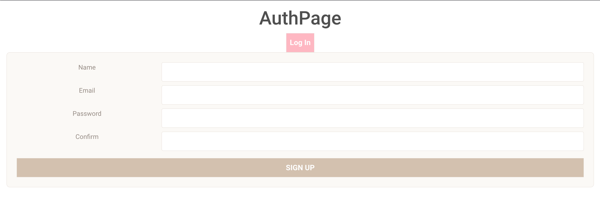
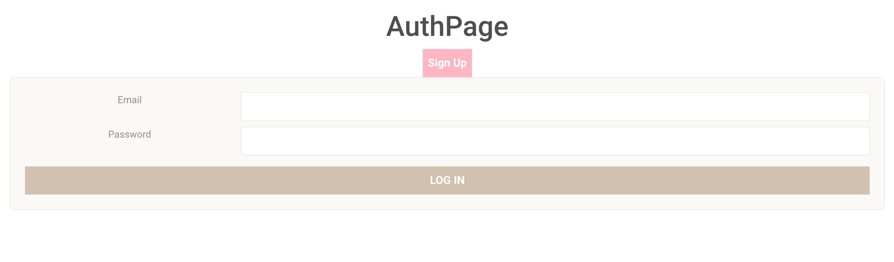
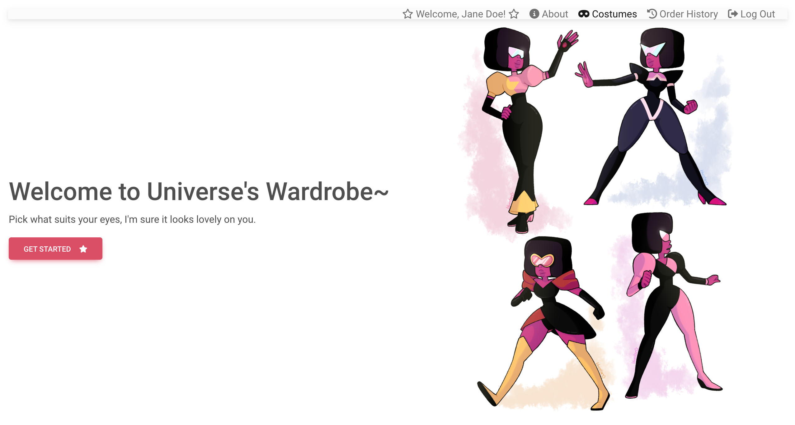
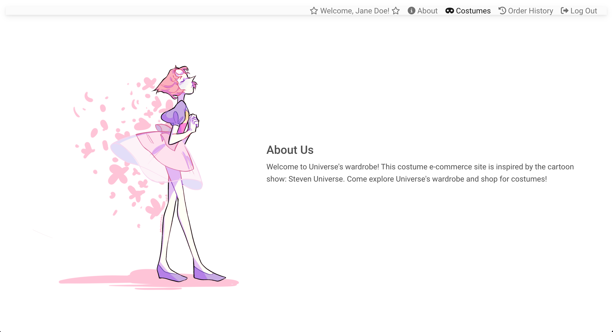
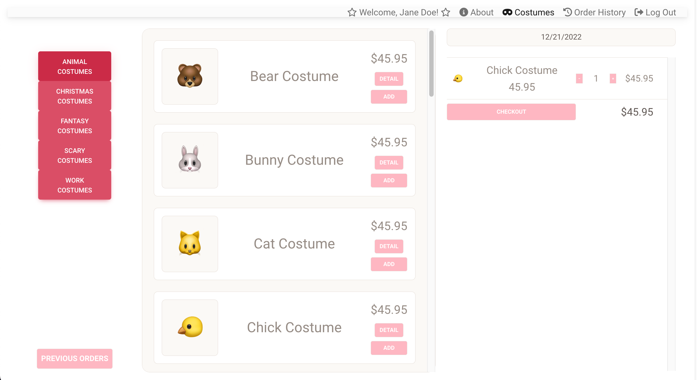
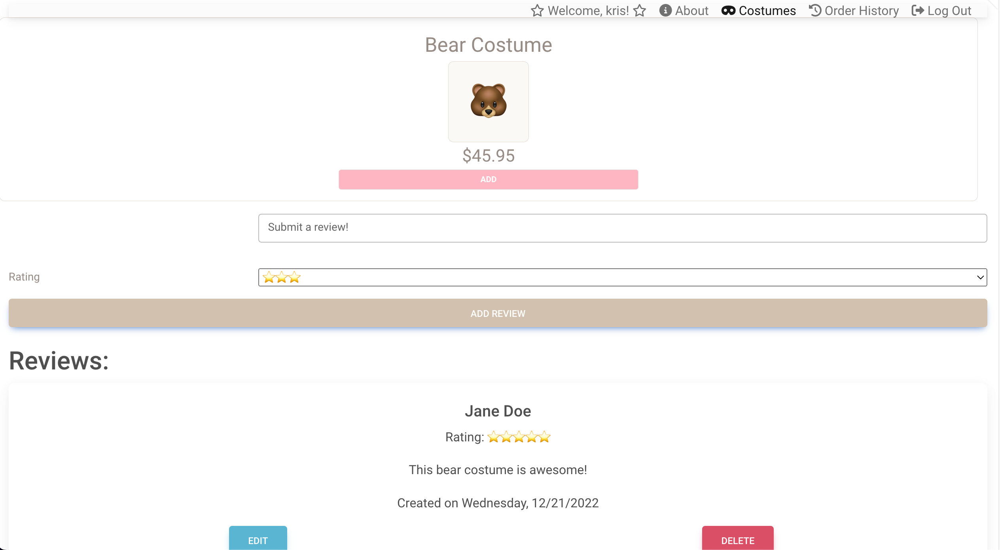
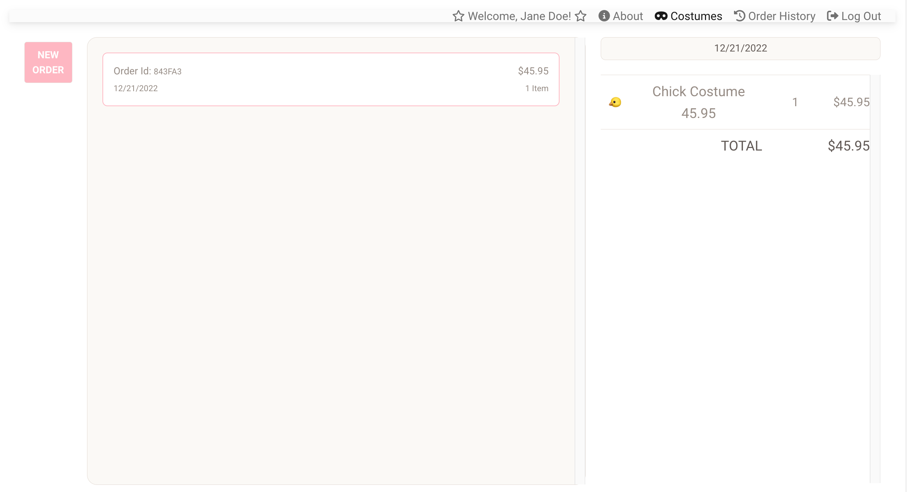

  # :fairy: Universe's Wardrobe :fairy:

  ### [Come shop for costumes!](http://universe-wardrobe.herokuapp.com/)

  ##### Created by Kristina Lim

  

  ## :pencil: Description

  OOTD is a good way to keep track of what the user has worn throughout the week. A user can add a post, add a link to the photo, write what they did on that day and describe their outfit and paste a link of their clothing item. The user can also look at other users' post by going to the homepage in order to get some outfit ideas. In case there are spelling errors, or the user wants to add more information, they can edit their entry. If they want to remove it completely, they can remove it. 

  

   ## :camera_flash: Screenshots 
<h3 align="center">Signup Form</h3>
 
<h3 align="center">Login Form</h3>
 
<h3 align="center">Homepage</h3>
 
<h3 align="center">About</h3>
 
<h3 align="center">Costumes</h3>
 
<h3 align="center">Costume Detail Page</h3>
 
<h3 align="center">Order History</h3>

## :computer: Technologies Used

 

## :spiral_notepad: Getting Started

 #### [Project planning and wireframing](https://trello.com/b/yBjacPKP/project-4-universes-wardrobe)

## :ice_cube: Icebox Features :ice_cube:
* Allow users to upload a photo in their review to give other user's a glimpse of what the costume looks like in real life.
* Add a shipping page in order for the e-commerce experience.
* Add a cart in navbar and implement notification.

